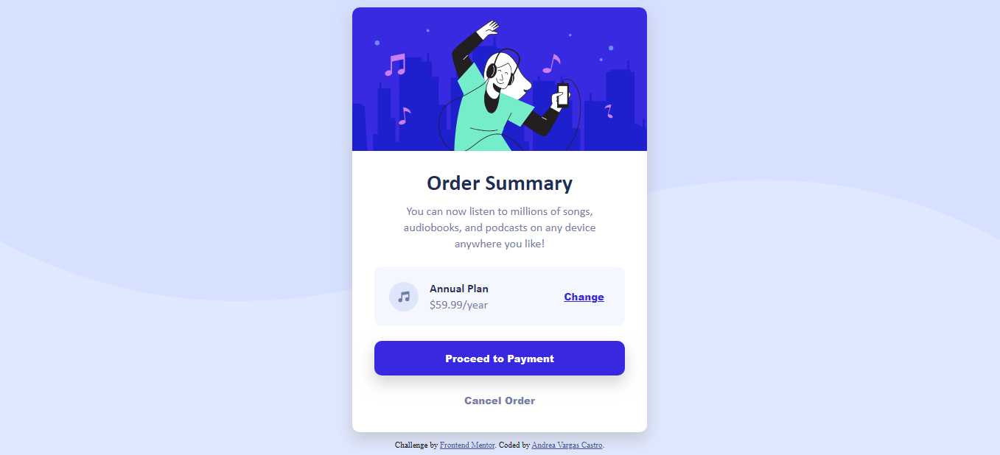

# Frontend Mentor - Order summary card solution

This is a solution to the [Order summary card challenge on Frontend Mentor](https://www.frontendmentor.io/challenges/order-summary-component-QlPmajDUj). Frontend Mentor challenges help you improve your coding skills by building realistic projects.

## Welcome! 👋

You are invited to review my coding solution on this front-end challenge of [Frontend Mentor](https://www.frontendmentor.io).

This project required basic knowledge of **HTML** and **CSS**.

## Table of contents ✨

- [Overview 📑](#overview)
  - [The challenge](#the-challenge)
  - [Screenshot](#screenshot)
  - [Links](#links)
- [My process 🦠](#my-process)
  - [Built with](#built-with)
  - [Useful resources](#useful-resources)
- [Author 🙆](#author)
- [Experience 🌱](#acknowledgments)

## Overview 📑

### The challenge

**Objective**: build a order summary card component that looking as close to the original design as possible.

The developer must be able to:

- See hover states for interactive elements.

### Screenshot

### Links

- Solution URL: [Github repository](https://github.com/Yasmineili/order-summary-component-main-avc)
- Live Site URL: [website](https://yasmineili.github.io/order-summary-component-main-avc/)

## My process 🦠

### Built with

- Semantic HTML5 markup
- CSS custom properties
- Flexbox

### Useful resources

- [CSS Diner](https://flukeout.github.io/) - This minigame helped me understand a different way to select elements, it's really entertaining.

## Author 🙆

- Frontend Mentor - [@Yasmineili](https://www.frontendmentor.io/profile/Yasmineili)

## Experience 🌱

This is my second frontend code challenge, it was more simple than the first challege. The complicated thing sometimes is to 'guess' the sizes that are not specified within the challenge to make it as similar as possible. 
All feedback are well received. 🐋

**Have good day!** 🚀
